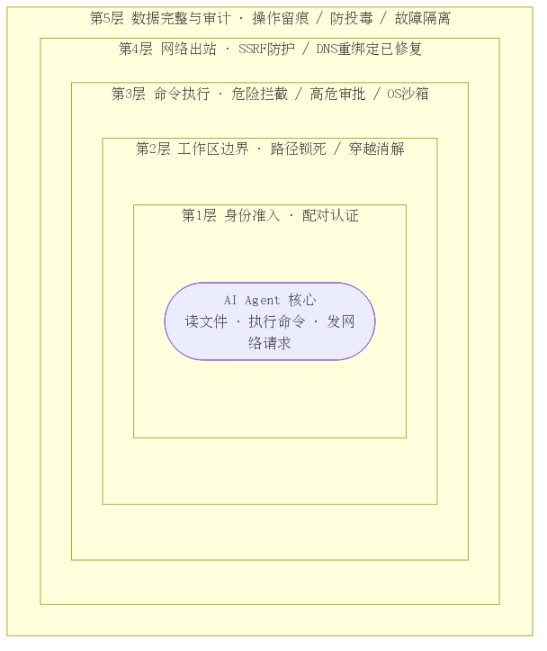
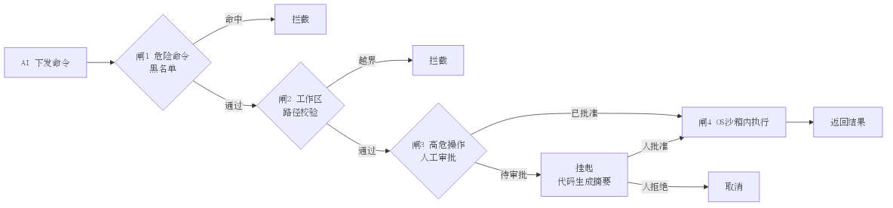

<!-- _class: lead -->

# nanobot 安全体系
## AI 会议任务督办系统的运行期安全保障

**汇报对象**:【甲方名称】
**汇报方**:【我方名称】
**日期**:2026 年 6 月

> 今天不讲功能多,只讲一件事:把 AI 放进业务系统,我们怎么保证它不闯祸。

---

## 为什么安全是这份合同的前提

AI agent 一旦"能动手",安全就是地基,不是锦上添花

- 本系统里 AI 能**读文件、执行命令、发网络请求**——有能力,也有风险
- 误删数据、外泄信息、被诱导越权,都不是假设
- 2025 年行业已有多起 AI agent 真实安全事件
- **结论**:选供应商,先看安全,再看功能

> 就像选进家干活的工人,先看他会不会乱翻东西,而不是干活快不快。

---

## 行业现实:AI agent 安全事件已经在发生

- 2025 年 GitHub Copilot 因 prompt 注入导致远程代码执行(严重级别)
- 多个主流 AI agent 框架被公开报告 SSRF 漏洞,可窃取云凭证
- 学术研究:仅 5 篇精心构造文档,90% 概率污染 RAG、操纵 AI 行为
- OWASP 已把"AI 注入"列为 LLM 应用**头号风险**

> 不是理论风险,是已经发生的行业事故。

---

## 我们的安全设计哲学:四条原则

1. **边界即代码**:三大安全边界全部写成代码强制执行,不靠人工自觉
2. **纵深叠加**:多层防护,任一层被绕过,其他层仍兜底
3. **抗诱导**:安全决策不依赖 AI"自觉",被诱导也执行不了危险动作
4. **显式逃生口**:所有例外都走显式配置审批,不留隐式后门

> 原则 3 是关键差异化——很多竞品是"提醒 AI 别做",我们是"AI 想做也做不了"。

---

## 安全体系全景:五层防护覆盖全部危险面

- **第1层 身份准入**:平台发送方配对认证
- **第2层 工作区边界**:文件目录访问锁死
- **第3层 命令执行**:拦截 + 审批 + 沙箱
- **第4层 网络出站**:SSRF 防护
- **第5层 数据完整**:防投毒 + 审计追溯

> 五层是纵深,不是并列——要同时突破多层才能造成实际危害。

---

## 第 1 层 · 身份准入:不让陌生人指挥你的 AI

- 系统可对接企业 IM(飞书/钉钉/企微),但**不是谁发消息都响应**
- 未授权发送方收到一次性配对码,必须由管理员**显式批准**
- 配对码短时效(10 分钟)自动失效,支持随时撤销
- 管理员可随时查看、审批、撤销授权列表

> AI 听谁的话,由管理员说了算,不由谁嗓门大说了算。

---

## 第 2 层 · 工作区边界:AI 的手脚只能在指定范围内

- 所有文件读写,强制限制在授权工作目录内
- 符号链接、路径穿越(`../`)在**解析阶段**就被消解拦截
- 越界不报"找不到"软错误,而是硬性拒绝,并**告知 AI 不得换工具重试**
- 媒体上传目录单独只读开放,其余一律封锁

> 很多系统被攻破,是因为 AI 被拒后"换个姿势再试"。我们封死了重试路径。

---

## 第 3 层 · 命令执行安全(核心):四道闸门

1. **破坏性命令黑名单**:删库、格式化、fork 炸弹自动拦截
2. **工作区限制**:命令里的路径同样校验,防逃逸
3. **高危操作人工审批**:审批摘要由**代码生成,不经 AI 之手**
4. **OS 沙箱隔离**:命令在独立沙箱内运行,凭证对沙箱不可见

> 闸 3 是亮点——审批提示不能让 AI 自己写,否则它会说谎骗审批人。

---

## 第 4 层 · 网络出站 SSRF 防护:堵死"借 AI 访问内网"

- 所有网络请求默认**禁止**访问内网、本机、云元数据端点
- 不仅看网址字面,而是**解析 IP 后校验**,防伪装
- 防御 DNS 重绑定:校验与连接同一环节,不留时间差(行业已知漏洞,我们已修复)
- 跟随网页跳转时每一跳都重新校验
- 仅管理员白名单地址可放行

**修复前(行业漏洞):** 校验时解析到公网 IP,连接时 DNS 已变为内网 IP
**修复后(我们):** 校验与连接合并,直连已校验 IP,消除二次解析

> AI 没办法被诱导去偷云服务的钥匙。

---

## 第 5 层 · 数据完整与审计:平时不被污染,出事能查清

- **审计可追溯**:每次 AI 操作留痕,含时间、对象、结果
- **内存防投毒**:写入内容按来源标记,回读时标注"外部不可信,不得当指令"
- **历史完整性**:会话记录原子写入,崩溃不损坏
- **故障隔离**:AI 出错只影响单次任务,不破坏业务主流程和数据

> AI 做的每件事都有据可查,被带偏了也有机制拉回来。

---

## 安全加固已完成:从"够用"到"行业领先"

| 安全维度 | 加固前 | 加固后(本轮升级) |
|---|---|---|
| 网络防护 | 校验网址再请求 | 修复 DNS 重绑定,校验与连接合并 |
| 命令执行 | 静态拦截危险命令 | 增加高危操作人工审批闸 |
| 沙箱隔离 | 容器级沙箱 | 可选升级到系统级隔离 |
| 凭证保护 | 配置文件存放 | 凭证不进沙箱,短时效注入 |
| 可观测性 | 基础日志 | 全量操作审计 + 异常告警 |

> 我们对照行业最新威胁,把每个维度都向上推了一档——交付前就做完。

---

## 对标行业:我们的安全水位

| 能力维度 | 主流开源框架 | 商用 Agent 平台 | 我们 |
|---|:---:|:---:|:---:|
| 身份准入 | 1 | 4 | 4 |
| 工作区隔离 | 1 | 3 | 4 |
| 命令防护 | 2 | 3 | 4 |
| 网络防护(SSRF) | 2 | 3 | 4 |
| 审计追溯 | 2 | 4 | 4 |
| **可私有部署/源码可审** | 5 | 1 | **5** |

> 同等安全水位下,我们能私有部署、源码可审计——对有合规要求的甲方是决定性优势。

---

## 风险可控:把"安全"翻译成业务语言

- **不会因 AI 误操作丢数据**:工作区边界 + 命令拦截 + 审批三重保障
- **不会因 AI 被诱导泄密**:SSRF 防护 + 凭证隔离,内网与密钥对 AI 不可达
- **不会因 AI 故障停业务**:故障隔离,AI 出错不影响业务主流程
- **出问题能查清**:全量审计,每次操作可追溯到人和时间
- **合规友好**:满足数据不出域、操作可审计、权限可管控的常见要求

> 我们有信心、有机制保证,但不说"100% 不可能"。

---

## 已验证:安全机制经得起检验

- **自动化测试**:安全边界有专项用例,覆盖路径穿越、命令绕过、SSRF
- **漏洞修复验证**:DNS 重绑定修复有针对性测试(模拟攻击 DNS 验证已堵死)
- **对抗性自查**:交付前对照 OWASP AI 安全清单逐项核查
- **持续验证机制**:安全相关代码改动强制关联测试,防回归

> 安全不是嘴上说,是有测试用例能跑给你看的。

---

## 落地保障:交付后安全怎么持续

- **交付即安全**:上线即带完整安全配置,不依赖甲方自行加固
- **可配置不裸奔**:默认安全策略开箱即用,高危能力默认关闭
- **运维手册**:配套安全运维文档,含配置、审计、应急流程
- **应急响应**:约定安全事件响应时效,提供漏洞修复更新通道
- **持续跟进**:跟踪行业新威胁,定期评估并推送安全更新

> 默认安全——很多事故源于"功能默认开、安全默认关",我们反过来。

---

## 商业价值:安全投入是省下更大的隐性成本

- **降低事故成本**:一次数据泄露/误删损失,远超安全投入
- **加速合规过审**:安全能力内置,缩短甲方安全评审周期
- **降低运维负担**:默认安全 + 审计内置,减少事后排障与合规举证
- **保护品牌信任**:AI 出事是头条新闻,安全是品牌护城河
- **降低总拥有成本**:安全内建 vs 事后补丁,前者成本数倍低于后者

> 事后补一个漏洞的成本,是设计阶段就防住的 10 倍以上。我们提前做了,等于替甲方省钱。

---

## 为什么选我们

- **五层纵深防护**,覆盖 AI agent 全部危险面,不是单点补丁
- **抗诱导设计**,安全决策不经 AI 之手,被诱导也执行不了危险动作
- **已主动加固**,修复行业已知漏洞,交付即是领先水位
- **可审计可私有部署**,源码可审、数据不出域,满足合规刚需
- **安全即服务**,默认安全 + 持续更新,长期可托付

> 这家想清楚了。

---

## 下一步与协作建议

- **演示安排**:可现场演示安全机制拦截效果(越界/危险命令/SSRF)
- **安全评审**:可配合甲方安全团队做专项评审与渗透测试
- **定制化**:按甲方合规要求(等保/数据出境等)调整安全策略
- **分阶段交付**:核心安全能力随首版交付,持续加固随版本迭代
- **联系窗口**:【我方联系人 / 联系方式】

> 敢让甲方攻,说明对安全有底气。

---

<!-- _class: lead -->

# Q&A

预留 7 分钟问答

**常见问题预案(讲者备稿):**
- "能做到 100% 安全吗?" → 纵深降险非绝对;降到行业领先、可控可追溯
- "性能开销多大?" → 沙箱/校验毫秒级;高危场景才触发审批
- "和现有安全体系怎么配合?" → 可对接企业 IAM/日志/审计
- "出事了谁负责?" → 责任边界合同明确;承诺机制到位、可验证、持续维护
