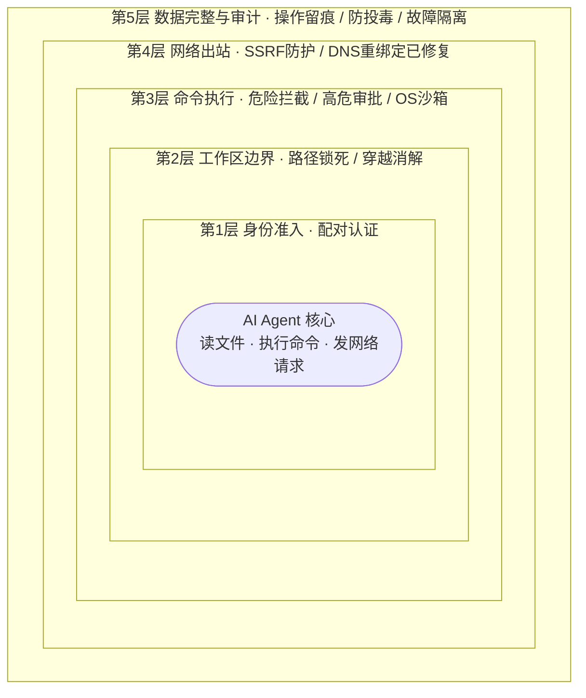
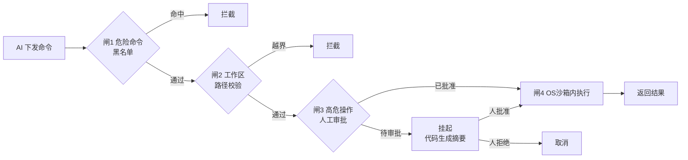
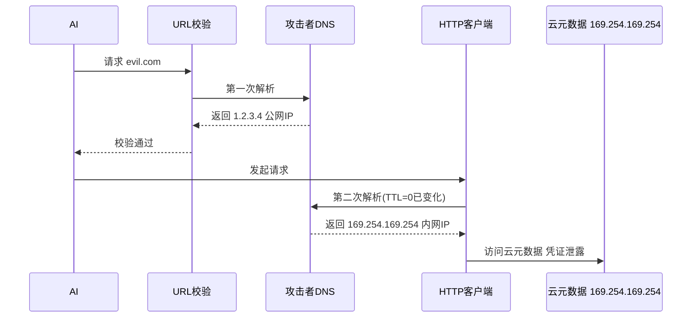
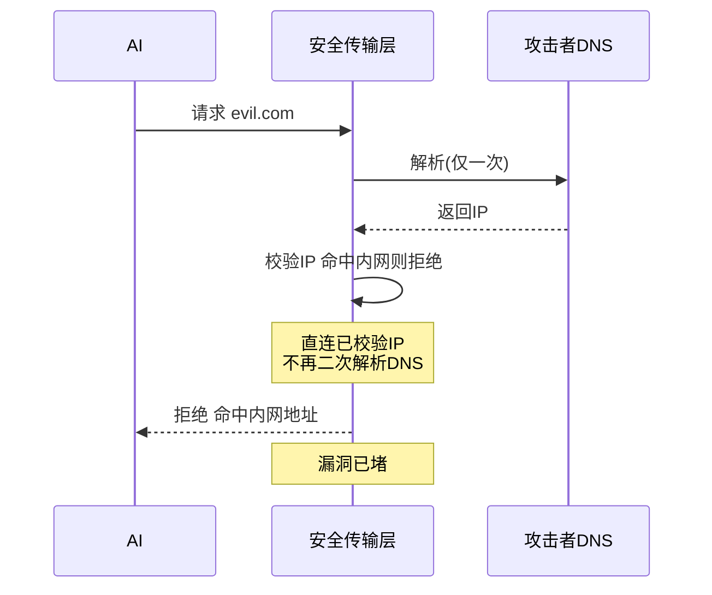

# nanobot 安全体系汇报

> 面向业务决策层 · 争取软件开发合同的技术答辩材料
>
> 使用说明:本文件为逐页大纲。每页给出「标题 / 要点 / 备注」三段。要点直接落到 PPT 正文,备注是演讲口径,可放到讲者视图或备稿用。建议总时长 25 分钟,正文 18 分钟 + Q&A 7 分钟。

---

## 第 1 页 · 封面

**标题**:nanobot 安全体系 —— AI 会议任务督办系统的运行期安全保障

**要点**:

- 汇报对象:【甲方名称】
- 汇报方:【我方名称】
- 日期:2026 年 6 月

**备注**:开场一句话定调——"今天不讲功能多,只讲一件事:把 AI 放进业务系统,我们怎么保证它不闯祸。"决策层最担心的不是 AI 能不能做,而是做了会不会出事。整场围绕这个焦虑展开。

---

## 第 2 页 · 为什么安全是这份合同的前提

**标题**:AI agent 一旦"能动手",安全就是地基,不是锦上添花

**要点**:

- 本系统里 AI 不是聊天机器人,它能**读文件、执行命令、发网络请求**
- 这意味着:它能帮业务提效,也**有能力**误删数据、外泄信息、被诱导越权
- 2025 年行业已有多起 AI agent 真实安全事件(详见下页)
- **结论**:选供应商,先看安全,再看功能。安全不过关,功能越多风险越大

**备注**:这页建立"安全=准入门槛"的共识。用类比:"就像选一个能进你家干活的工人,首先看他会不会乱翻东西,而不是他干活快不快。"把甲方心智从"比功能"拉到"比安全"——这正是我们的强项。

---

## 第 3 页 · 行业现实:AI agent 安全事件已经在发生

**标题**:这不是理论风险,是已经发生的行业事故

**要点**:

- 2025 年 GitHub Copilot 因 prompt 注入导致远程代码执行(CVE,严重级别)
- 多个主流 AI agent 框架被公开报告 SSRF 漏洞,可被利用访问云元数据窃取凭证
- 学术研究:仅 5 篇精心构造的文档,就能 90% 概率污染 RAG、操纵 AI 行为
- 权威机构(OWASP)已把"AI 注入"列为 LLM 应用头号风险

**备注**:用真实事件制造紧迫感,但**不点名竞品、不制造恐慌**。目的是让决策层理解"我们花大力气做安全,是因为行业真出过事,不是我们在堆功能凑卖点"。资料来源:OWASP LLM01:2025、公开漏洞报告。

---

## 第 4 页 · 我们的回答:nanoBot 的安全设计哲学

**标题**:四条原则,贯穿整个安全体系

**要点**:

1. **边界即代码**:三大安全边界全部写成代码强制执行,不靠人工自觉
2. **纵深叠加**:多层防护,任一层被绕过,其他层仍兜底
3. **抗诱导**:安全决策不依赖 AI"自觉",被诱导也执行不了危险动作
4. **显式逃生口**:所有例外都走显式配置审批,不留隐式后门

**备注**:这页是全篇的"魂"。四条原则后面每一项加固都能对回来。告诉决策层:我们不是堆了一堆零散防护,而是有一以贯之的设计思想。**原则 3 是关键差异化**——很多竞品的防护是"提醒 AI 别做",我们是"AI 想做也做不了"。

---

## 第 5 页 · 安全体系全景图

**标题**:从外到内五层防护,覆盖 AI agent 全部危险面

**要点**:(建议做成一张同心圆 / 分层图)

- **第 1 层 身份准入**:聊天平台发送方配对认证,陌生人发消息不响应
- **第 2 层 工作区边界**:文件与目录访问锁死在授权目录内
- **第 3 层 命令执行**:破坏性命令拦截 + 高危操作人工审批 + OS 沙箱隔离
- **第 4 层 网络出站**:SSRF 防护,阻断对内网与云元数据的访问
- **第 5 层 数据完整**:内存/历史防投毒 + 全程审计可追溯

**备注**:这页是全篇的导航图。后面 5 页(第 6–10)逐一展开每一层。提醒决策层:五层不是并列堆砌,是**纵深**——攻击要同时突破多层才能造成实际危害。

---

## 第 6 页 · 第 1 层 身份准入

**标题**:不让陌生人指挥你的 AI

**要点**:

- 系统可对接企业 IM(飞书/钉钉/企微等),但**不是谁发消息都响应**
- 未授权发送方收到一次性配对码,必须由管理员**显式批准**后才能使用
- 配对码短时效(10 分钟)自动失效,支持随时撤销
- 管理员可随时查看、审批、撤销授权列表

**备注**:解决"AI 在群里被陌生人 @ 一下就干活"的风险。对企业尤其重要——员工离职、外部人员进群,都需要可控的授权机制。一句话:"AI 听谁的话,由管理员说了算,不由谁嗓门大说了算。"

---

## 第 7 页 · 第 2 层 工作区边界

**标题**:AI 的手脚,只能在指定范围内活动

**要点**:

- 所有文件读写,强制限制在授权工作目录内
- 符号链接、路径穿越(`../`)等绕过手段,在**路径解析阶段**就被消解拦截
- 越界不报"找不到"的软错误,而是硬性拒绝,并**明确告知 AI 不得换工具重试**
- 媒体上传目录单独只读开放,其余一律封锁

**备注**:这页讲清"防绕过"。重点强调最后一点——很多系统被攻破,是因为 AI 被拒后"换个姿势再试"(用 shell、用 base64 编码),我们直接在错误信息里封死了重试路径。**这是抗诱导原则的具体体现。**

---

## 第 8 页 · 第 3 层 命令执行安全(核心)

**标题**:命令执行——风险最高,防护最多

**要点**:(建议做成"四道闸门"的流程图)

1. **破坏性命令黑名单**:自动拦截删库、格式化、fork 炸弹等
2. **工作区限制**:命令里的路径同样校验,防逃逸
3. **高危操作人工审批**:删数据、改环境、外发等动作,先弹审批,**审批摘要由代码生成,不经 AI 之手**
4. **OS 沙箱隔离**:命令在独立沙箱内运行,凭证对沙箱不可见

**备注**:这是全篇技术含量最高的一页,但要讲得通俗。第 3 道闸是亮点——"审批提示不能让 AI 自己写,否则它会说谎骗审批人。我们用代码直接提取命令摘要,人看到的是真实要执行的命令,不是 AI 转述的。"对应行业已披露的"用谎言骗过人工审批"的攻击手法。

---

## 第 9 页 · 第 4 层 网络出站 SSRF 防护

**标题**:堵死"借 AI 之手访问内网"这条路

**要点**:

- AI 的所有网络请求,默认**禁止**访问内网地址、本机、云元数据端点
- 不仅看网址字面,而是**真正解析 IP 后校验**,防止伪装
- 防御 DNS 重绑定攻击:校验与连接同一环节完成,不留时间差
- 跟随网页跳转时,每一跳都重新校验,防止"先去安全地址再跳到内网"
- 仅管理员配置的白名单地址可放行

**备注**:这页对懂技术的评标专家是关键加分项。我们主动修复了一个行业普遍存在的漏洞(校验与连接的时间差问题),这正是"安全加固已完成"的证据。对非技术领导,一句话概括:"AI 没办法被诱导去偷云服务的钥匙。"

---

## 第 10 页 · 第 5 层 数据完整与审计

**标题**:可追溯 + 防投毒,出事能查清,平时不被污染

**要点**:

- **审计可追溯**:每次 AI 操作(读文件/执行命令/发请求)留痕,含时间、对象、结果
- **内存防投毒**:AI 写入的内容按来源标记,回读时明确标注"外部不可信内容,不得当作指令"
- **历史完整性**:会话记录原子写入,崩溃不损坏;禁止直接篡改内部状态文件
- **故障隔离**:AI 出错只影响单次任务,不破坏业务主流程和数据

**备注**:决策层关心两件事——"平时别出事"和"出事能查清"。这页同时回应。审计是企业合规刚需;防投毒回应"AI 被一篇恶意文档带偏"的长期风险。一句话:"AI 做的每件事都有据可查,被带偏了也有机制拉回来。"

---

## 第 11 页 · 安全加固已完成:从"够用"到"行业领先"

**标题**:我们已主动完成一轮深度安全加固

**要点**:(建议做成"加固前 → 加固后"对照表)

| 安全维度 | 加固前(基础防护) | 加固后(本轮升级) |
|---|---|---|
| 网络防护 | 校验网址再请求 | 修复 DNS 重绑定漏洞,校验与连接合并 |
| 命令执行 | 静态拦截危险命令 | 增加高危操作人工审批闸 |
| 沙箱隔离 | 容器级沙箱 | 可选升级到系统级隔离(更强) |
| 凭证保护 | 配置文件存放 | 凭证不进沙箱,短时效注入 |
| 可观测性 | 基础日志 | 全量操作审计 + 异常告警 |

**备注**:这页是"加固已完成"的核心证据页。强调"主动"——不是出了事才补,是交付前就做完。对照表让决策层一眼看到投入和提升。讲法:"我们对照行业最新威胁,把每个维度都向上推了一档。"

---

## 第 12 页 · 对标行业:我们处在什么位置

**标题**:与主流方案对比,我们的安全水位

**要点**:(建议做成能力雷达图或对照表)

- **对比开源 AI 框架**:多数无工作区边界、无审批闸、SSRF 校验存在已知漏洞
- **对比商用 agent 平台**:安全能力接近,但我们**源码可审计、可私有部署**
- **我们的差异化**:抗诱导设计(安全决策不经 AI)+ 已修复行业已知漏洞 + 五层纵深

**备注**:对决策层,不贬低竞品,只摆事实。核心卖点:**"同等安全水位下,我们能私有部署、源码可审计"**——这对有数据安全合规要求的甲方是决定性优势。雷达图建议五个轴:身份准入/工作区隔离/命令防护/网络防护/审计追溯,我们填满,竞品按公开资料填。

---

## 第 13 页 · 风险可控:我们能承诺什么

**标题**:把"安全"翻译成业务能理解的语言

**要点**:

- **不会因 AI 误操作丢数据**:工作区边界 + 命令拦截 + 审批三重保障
- **不会因 AI 被诱导泄密**:SSRF 防护 + 凭证隔离,内网与密钥对 AI 不可达
- **不会因 AI 故障停业务**:故障隔离,AI 出错不影响业务主流程
- **出问题能查清**:全量审计,每次操作可追溯到人和时间
- **合规友好**:满足数据不出域、操作可审计、权限可管控的常见合规要求

**备注**:这页是给决策层的"定心丸"。把技术能力翻译成"不会发生 XX"的承诺。注意措辞分寸:承诺"不会因 AI 误操作丢数据"是基于多层防护,而非绝对保证。讲法用"我们有信心、有机制保证",不说"100% 不可能"。

---

## 第 14 页 · 已验证:安全机制经得起检验

**标题**:不是纸上谈兵,每一项都有验证

**要点**:

- **自动化测试**:安全边界有专项测试用例,覆盖路径穿越、命令绕过、SSRF 等场景
- **漏洞修复验证**:DNS 重绑定修复有针对性测试(模拟攻击 DNS 验证已堵死)
- **对抗性自查**:交付前对照 OWASP AI 安全清单逐项核查
- **持续验证机制**:安全相关代码改动强制关联测试,防回归

**备注**:决策层最怕"吹得好,实际没做"。这页用"测试 + 验证"建立可信度。强调"可验证、可复现"——安全不是嘴上说,是有测试用例能跑给你看的。如果现场能演示一个"尝试越界被拦截"的 demo,效果最好。

---

## 第 15 页 · 落地保障:交付后安全怎么持续

**标题**:安全不是一次性,是持续承诺

**要点**:

- **交付即安全**:上线即带完整安全配置,不依赖甲方自行加固
- **可配置不裸奔**:默认安全策略开箱即用,高危能力默认关闭
- **运维手册**:配套安全运维文档,含配置说明、审计查看、应急流程
- **应急响应**:约定安全事件响应时效,提供漏洞修复更新通道
- **持续跟进**:跟踪行业新威胁,定期评估并推送安全更新

**备注**:这页回应决策层的长期顾虑——"买完之后呢?"。把安全做成服务承诺而非一次性交付。强调"默认安全"——很多事故源于"功能默认开、安全默认关",我们反过来。这是工程成熟度的体现。

---

## 第 16 页 · 商业价值:安全如何转化为业务收益

**标题**:安全投入,是省下更大的隐性成本

**要点**:

- **降低事故成本**:一次数据泄露/误删的事故损失,远超安全投入
- **加速合规过审**:安全能力内置,缩短甲方安全评审周期
- **降低运维负担**:默认安全 + 审计内置,减少事后排障与合规举证工作
- **保护品牌信任**:AI 出事是头条新闻,安全是品牌护城河
- **降低总拥有成本**:安全内建 vs 事后补丁,前者成本数倍低于后者

**备注**:把安全从"成本项"重新定义为"投资项"。决策层关心 ROI,这页给算账逻辑:"事后补一个安全漏洞的成本,是设计阶段就防住的 10 倍以上(行业共识)。我们提前做了,等于替甲方省了这笔钱。"用"省下的事故成本"对冲"安全溢价"的疑虑。

---

## 第 17 页 · 为什么选我们

**标题**:一句话总结我们的不同

**要点**:

- **五层纵深防护**,覆盖 AI agent 全部危险面,不是单点补丁
- **抗诱导设计**,安全决策不经 AI 之手,被诱导也执行不了危险动作
- **已主动加固**,修复了行业已知漏洞,交付即是领先水位
- **可审计可私有部署**,源码可审、数据不出域,满足合规刚需
- **安全即服务**,默认安全 + 持续更新,长期可托付

**备注**:收束全场,五条对应前面的设计原则和加固成果。这是决策层离场后能记住的"电梯陈述"。讲的时候放慢节奏,一条一条落到画面上,给决策层留下"这家想清楚了"的印象。

---

## 第 18 页 · 下一步与协作建议

**标题**:推进路径与时间预期

**要点**:

- **演示安排**:可现场演示安全机制拦截效果(越界/危险命令/SSRF)
- **安全评审**:可配合甲方安全团队做专项评审与渗透测试
- **定制化**:按甲方合规要求(等保/数据出境等)调整安全策略
- **分阶段交付**:核心安全能力随首版交付,持续加固随版本迭代
- **联系窗口**:【我方联系人 / 联系方式】

**备注**:落到行动。给决策层一个清晰的"接下来做什么",把汇报转化为推进。主动提出"可配合渗透测试"是强力信号——敢让甲方攻,说明对安全有底气。最后留联系方式,自然过渡到 Q&A。

---

## 第 19 页 · Q&A

**标题**:答疑

**要点**:

- 预留 7 分钟问答
- 常见问题预案(讲者备稿,不上 PPT 正文):
  - "能做到 100% 安全吗?" → 安全是纵深降险,非绝对;我们做到的是把风险降到行业领先、且可控可追溯
  - "性能开销多大?" → 沙箱/校验开销在毫秒级,不影响业务体验;高危场景才触发审批
  - "和现有安全体系怎么配合?" → 可对接企业 IAM/日志/审计,不另起炉灶
  - "出事了谁负责?" → 责任边界在合同明确;我们的承诺是机制到位、可验证、持续维护

**备注**:Q&A 是答辩的关键,常比正文更影响结果。预案里的四个问题是决策层最可能问的,务必备好分寸得当的回答。"100% 安全"这种问题尤其要答得专业——不吹绝对,讲清"降到可控、可追溯"。

---

## 附录 A · 技术细节备查(不上正文,应对专家追问)

> 这一节不进 PPT 正文,供现场有技术专家追问时调用,或作为附件给甲方技术团队。

**A1. SSRF 与 DNS 重绑定**
- 威胁:校验 URL 时解析 DNS 为公网 IP,实际连接时 DNS 已变为内网 IP(TTL=0),绕过校验
- 我们的修复:校验与连接合并到同一环节(自定义 HTTP 传输层),解析后直连已校验 IP,消除二次解析
- 依据:OWASP A10 SSRF 指南、行业已披露同类漏洞

**A2. 高危操作人工审批**
- 威胁:AI 被诱导执行危险命令;或用"谎言"骗过人工审批(审批提示由 AI 生成时)
- 我们的机制:审批摘要由代码从命令结构提取,不经 AI;命中高危判定才触发,不干扰常规操作

**A3. 沙箱隔离层级**
- 应用层(路径校验)→ 容器层(bwrap)→ 系统层(gVisor/microVM,可选)
- 分级依据:单机轻量用 bwrap,多租户/跑不可信代码升级系统级隔离

**A4. 凭证保护**
- 凭证不进沙箱进程可见范围;短时效注入;配置文件不含明文密钥(环境变量引用)
- 出站可经策略代理,deny-by-default + 域名白名单

**A5. 审计与合规映射**
- 审计字段:时间、会话、操作类型、对象、决策(放行/拦截)、操作人
- 可对接 SIEM;满足"操作可追溯、权限可管控"类合规要求

---

## 附录 B · 演讲节奏建议

| 页码 | 时长 | 节奏建议 |
|---|---|---|
| 1–4 | 4 min | 快速建立共识,不纠缠细节 |
| 5 | 1 min | 全景图,埋下"五层"主线 |
| 6–10 | 8 min | 逐层展开,每层一个亮点 + 一句大白话 |
| 11 | 2 min | 加固已完成,核心证据,放慢 |
| 12–13 | 3 min | 对标与承诺,建立可信度 |
| 14–15 | 2 min | 验证与保障,回应长期顾虑 |
| 16–17 | 2 min | 商业价值与总结,情绪高点 |
| 18–19 | 3 min | 推进与 Q&A |

**核心情绪线**:担忧(行业出事)→ 信心(我们有体系)→ 信任(已加固已验证)→ 行动(选我们)。

---

*本材料技术内容基于 nanobot 实际代码与已完成的安全加固设计。汇报前请将【括号占位符】替换为实际信息,并视甲方行业调整合规表述(如金融加等保、医疗加数据出境)。*

---

## 附录 C · 关键图示(Mermaid)

> 以下四张图对应正文"建议做成图"的位置。支持 Mermaid 的工具(WPS、Typora、各 AI 转 PPT 工具)可直接渲染;不支持的环境按图下提示手画。图示是决策层一眼看懂"五层纵深""四道闸门"的关键,务必落到 PPT。

### 图 1 · 五层防护纵深(对应第 5 页,全篇骨架)

洋葱模型:AI 核心被五层防护由外向内包裹。

**演讲口径**:指着核心圈说——"AI 的所有能力都在这里,但每一项动作都要穿过五层防护。攻击者要造成实际危害,得同时突破五层,不是破一层就够了。"

---

### 图 2 · 命令执行四道闸门(对应第 8 页,技术核心)

**演讲口径**:重点讲闸 3 的挂起分支——"审批摘要由代码从命令结构提取,**不经 AI 之手**,所以 AI 没法用谎言骗审批人。"这是抗诱导原则的具象化。

---

### 图 3 · SSRF 修复前后对比(对应第 9 页 / 附录 A1,应对专家追问)

左侧为行业普遍存在的漏洞,右侧为我们已完成的修复。

**修复前(漏洞:校验与连接的时间差)**

**修复后(校验与连接合并,消除二次解析)**

**演讲口径**:对技术专家——"我们主动修复了行业已披露的 DNS 重绑定漏洞,把校验从'URL 解析层'下沉到'连接层',从机制上消除时间差。"对非技术领导——一句话:"AI 没办法被诱导去偷云服务的钥匙。"

---

### 图 4 · 对标雷达数据(对应第 12 页,差异化)

雷达图 Mermaid 不直接支持,按下方数据用 PPT 自带雷达图绘制。5=强,1=弱。

| 能力维度 | 主流开源框架 | 商用 Agent 平台 | 我们 |
|---|:---:|:---:|:---:|
| 身份准入 | 1 | 4 | 4 |
| 工作区隔离 | 1 | 3 | 4 |
| 命令防护 | 2 | 3 | 4 |
| 网络防护(SSRF) | 2 | 3 | 4 |
| 审计追溯 | 2 | 4 | 4 |
| **可私有部署/源码可审** | 5 | 1 | **5** |

**演讲口径**:五个安全维度我们填满;最后一行是决定性差异——"商用平台安全虽接近,但不可私有部署、源码不可审;开源框架可部署但安全是短板。**只有我们两者兼具**。"数据基于公开资料与代码审计,分值供示意,可在专家追问时说明依据。
